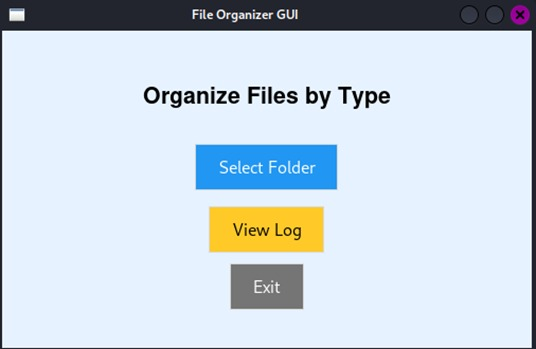

# FileOrganizerScript
 
 🗂️ File Organizer GUI

A Python GUI application that automatically organizes files in a selected directory into categorized folders (like Documents, Images, Videos, Music, etc.) based on file extensions.

 

# 👥 Team Members  

| Parul  | Armanpreet Kaur |
| ------------- | ------------- |
| Bhumika Chopra  | Jashanpreet Kaur  |

 

# 📋 Project Overview

The File Organizer Script is a Linux-based desktop utility developed using Python and Tkinter that automates the organization of files into categorized folders such as Images, Documents, Music, and Videos. It simplifies file management, maintains detailed activity logs, and offers a clean, user-friendly graphical interface for efficient system usage.
  

  

 
  
# ✨ Features

- Organizes files into categories automatically
- Simple and clean GUI using Tkinter
- Keeps a log of moved files
- Lightweight and fast
- Cross-platform (Windows, macOS, Linux)

 

# 🔧 Built With

- Python 3.x
- Tkinter (GUI)
- os, shutil, datetime (Standard libraries)

 

# 🛠️ Technical Implementation

## System Architecture
  

  

# 🎓 Learning Outcomes

- Built a Python-Tkinter GUI for desktop automation.
- Learned Linux file handling and directory operations.
- Implemented file categorization and activity logging.
- Gained experience in modular design and GUI integration.
- Improved skills in automating system tasks for better efficiency.
- Understood the integration of GUI with backend file operations.

 

# 📝 Project Report
Our detailed project report covers:

System architecture
Implementation details
Testing methodology
Performance analysis
Future improvements

 

# 🤝 Acknowledgments
We would like to thank our course instructor and mentors for their guidance throughout this project.

Developed as part of Linux System Programming Course

© 2025 Team FileOrganizerScript

